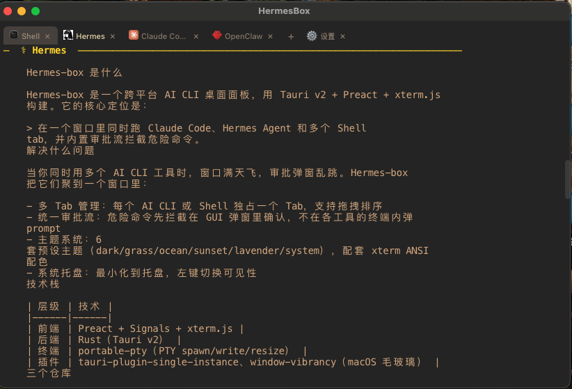
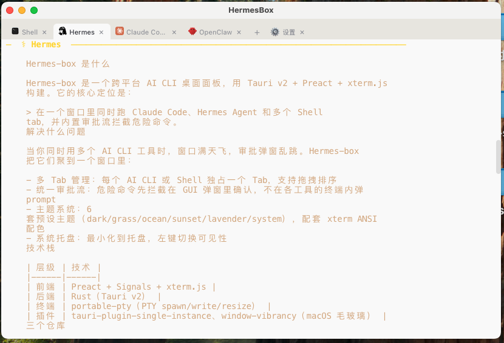

# Hermes-Box

Cross-platform desktop panel for AI CLIs. Run Claude Code, Hermes Agent, and multiple shell tabs in one window with built-in approval interception.

**[中文版](README_zh.md)**

## Features




- **Multi-tab terminal** — Run multiple AI CLIs and shells in tabs, with lazy PTY spawn for performance
- **CLI selector** — Built-in detection for Claude Code, Hermes, OpenClaw, Codex, OpenCode, and custom CLI tools
- **Approval system** — Intercept dangerous commands via file-based bridge, approve/deny from GUI
- **Multi-theme** — Dark, Flexoki Light, Gruvbox Dark, Atom One Light presets with Hermes color sync
- **External terminal** — Launch CLI in your default terminal app instead of the embedded one
- **System tray** — Minimize to tray, stay running in background
- **Auto-start** — Launch at login via LaunchAgent (macOS)
- **i18n** — English and Chinese UI

## Install

### macOS (GitHub Release)

Download the latest `.tar.gz` from [Releases](https://github.com/BotonJ/Hermes-Box/releases), then:

```bash
tar xzf hermes-box-v2-*.tar.gz
mv HermesBox.app /Applications/
```

First launch: right-click the app > **Open** to bypass Gatekeeper.

### Homebrew

```bash
brew install --cask hermes-box
```

## Develop

Prerequisites: [Rust](https://rustup.rs), [Node.js](https://nodejs.org) 22+, [pnpm](https://pnpm.io)

```bash
pnpm install
pnpm tauri dev           # dev mode with hot reload
```

### Test

```bash
pnpm test                # frontend tests (vitest)
pnpm typecheck           # TypeScript check
cd src-tauri
cargo test               # Rust unit tests
cargo clippy -- -D warnings
```

### Build

```bash
pnpm tauri build         # produces src-tauri/target/release/bundle/macos/HermesBox.app
```

## Tech Stack

| Layer | Technology |
|-------|-----------|
| Backend | Rust, Tauri v2 |
| Frontend | Preact, TypeScript, xterm.js |
| Build | Vite, pnpm |

### Project Structure

```
src/
  App.tsx              # View state machine + tabs + approval integration
  components/
    TabBar.tsx         # Multi-tab management
    TerminalView.tsx   # xterm.js terminal view
    CLISelector.tsx    # CLI detection and launch
    Settings.tsx       # Settings page
    ContextMenu.tsx    # Tab context menu
  lib/
    cli-detect.ts      # CLI detection
    theme.ts           # Theme management
    xterm-themes.ts    # xterm ANSI color palettes
    hermes-colors.ts   # Hermes CLI color sync
    approval-bridge.ts # Approval file polling
    tab-storage.ts     # Tab persistence

src-tauri/src/
  lib.rs               # Plugin registration + setup
  pty.rs               # PTY spawn/write/resize
  window.rs            # Window position persistence
  tray.rs              # System tray
  approval.rs          # Approval file watcher
  terminal.rs          # External terminal launch
```

## Approval System

Hermes-Box intercepts tool calls from Claude Code and Hermes via shell hooks:

1. Hook script writes pending request to `~/.hermesbox/approvals/pending/`
2. Rust file watcher detects new files and emits event to frontend
3. GUI shows approve/deny dialog
4. Result written back for the CLI to consume

## Roadmap

- [ ] PTY resize fix (store master handle)
- [ ] tmux Control Mode integration
- [ ] Windows and Linux support
- [ ] Plugin system for custom CLIs

## License

[MIT](LICENSE)
