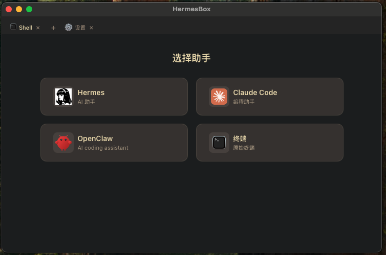
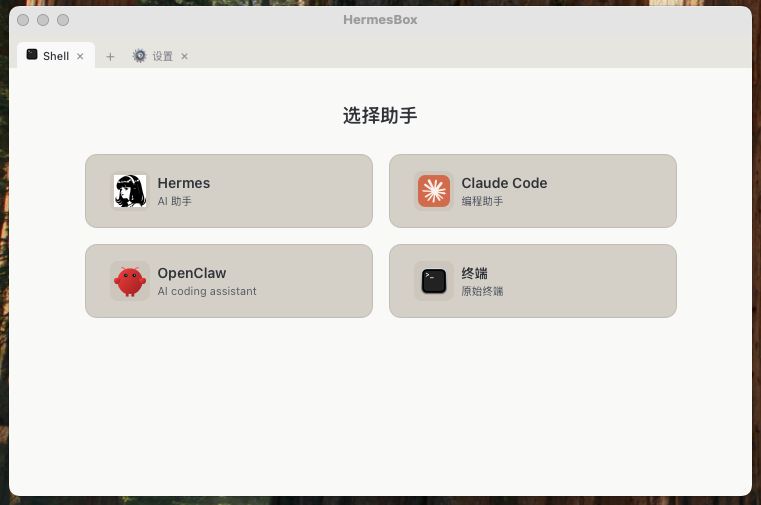
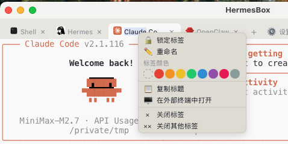
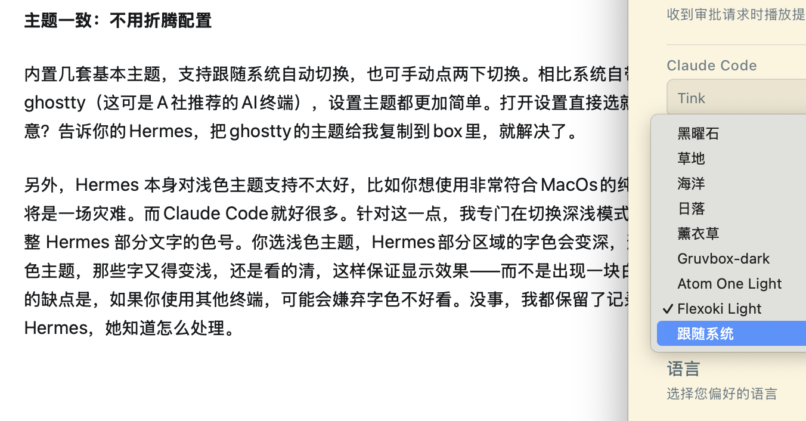

# Hermes-Box

Cross-platform desktop panel for AI CLIs. Run Claude Code, Hermes Agent, and multiple agents or shell tabs in one window with built-in approval interception.

**[中文版](README_zh.md)**

## Features






- **Multi-tab terminal** — Lazy PTY spawn, run multiple AI CLIs and shells in tabs for optimal performance
- **Tab management** — Right-click tabs to add custom colors, names, lock tabs, or open in external terminal
- **CLI selector** — Built-in detection for Claude Code, Hermes, OpenClaw, Codex, OpenCode, DeepSeek tui, and custom CLI tools
- **Approval system** — Intercept dangerous commands via file-based bridge, approve/deny from GUI
- **Multi-theme** — Dark, Flexoki Light, Gruvbox Dark, Atom One Light presets with Hermes color sync
- **External terminal** — Quick launch CLI in your default terminal app instead of the embedded one
- **System tray** — Minimize to tray, stay running in background, Command+Shift+H to show app
- **Auto-start** — Launch at login via LaunchAgent (macOS)
- **i18n** — English and Chinese UI

## Install

### macOS (GitHub Release)

Download the latest `.tar.gz` from [Releases](https://github.com/BotonJ/Hermes-Box/releases), then:

```bash
tar xzf hermes-box-v2-*.tar.gz
mv HermesBox.app /Applications/
```

First launch: right-click the app > **Open** to bypass Gatekeeper.

### Homebrew

```bash
brew install --cask hermes-box
```

### DMG

DMG one-click installer is now also available.

## Develop

Prerequisites: [Rust](https://rustup.rs), [Node.js](https://nodejs.org) 22+, [pnpm](https://pnpm.io)

```bash
pnpm install
pnpm tauri dev           # dev mode with hot reload
```

### Test

```bash
pnpm test                # frontend tests (vitest)
pnpm typecheck           # TypeScript check
cd src-tauri
cargo test               # Rust unit tests
cargo clippy -- -D warnings
```

### Build

```bash
pnpm tauri build         # produces src-tauri/target/release/bundle/macos/HermesBox.app
```

## Tech Stack

| Layer | Technology |
|-------|-----------|
| Backend | Rust, Tauri v2 |
| Frontend | Preact, TypeScript, xterm.js |
| Build | Vite, pnpm |

### Project Structure

```
src/
  App.tsx              # View state machine + tabs + approval integration
  components/
    TabBar.tsx         # Multi-tab management
    TerminalView.tsx   # xterm.js terminal view
    CLISelector.tsx    # CLI detection and launch
    Settings.tsx       # Settings page
    ContextMenu.tsx    # Tab context menu
  lib/
    cli-detect.ts      # CLI detection
    theme.ts           # Theme management
    xterm-themes.ts    # xterm ANSI color palettes
    hermes-colors.ts   # Hermes CLI color sync
    approval-bridge.ts # Approval file polling
    tab-storage.ts     # Tab persistence

src-tauri/src/
  lib.rs               # Plugin registration + setup
  pty.rs               # PTY spawn/write/resize
  window.rs            # Window position persistence
  tray.rs              # System tray
  approval.rs          # Approval file watcher
  terminal.rs          # External terminal launch
```

## Approval System


Hermes-Box intercepts tool calls from Claude Code and Hermes via shell hooks:

1. Hook script writes pending request to `~/.hermesbox/approvals/pending/`
2. Rust file watcher detects new files and emits event to frontend
3. GUI shows approve/deny dialog
4. Result written back for the CLI to consume
5. First-time setup requires adding Hooks configuration for Claude Code and Hermes in Settings. For existing configurations without injected Hooks, the button will first backup current settings before injection. Other CLIs are not configured yet — you can add them manually.
6. Sound support — When Claude Code or Hermes needs to execute shell commands for approval, a sound will play automatically. You can use system sounds or upload custom sound files.

## Theme Adaptation




Most terminal interfaces default to dark. Hermes Box adapts Ghostty's light themes — Atom One Light and Flexoki Light — and can automatically switch with system light/dark mode. Hermes's color style is not very friendly to light themes, so a special Hermes light adaptation is added. Click to change Hermes text colors for better clarity in light themes, with option to restore defaults.

A **SKILL-hermes-color-adjustment.md** is also included. Share this document with Hermes and she will know how to adjust the corresponding font colors.

## Roadmap

- [ ] Windows and Linux support
- [ ] Plugin system for custom CLIs
- [ ] Original new features (Pin & Limit Ring)

## Credits

Xiaomi Mimo V2.5pro contributed 90% of the code and documentation, the remaining 10% came from Zhipu GLM and DeepSeek, with a small portion from MiniMax.
iTerm2 and Ghostty provided guidance throughout the development process and offered samples for feature reference and design.

## License

[MIT](LICENSE)